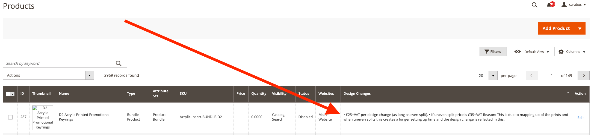
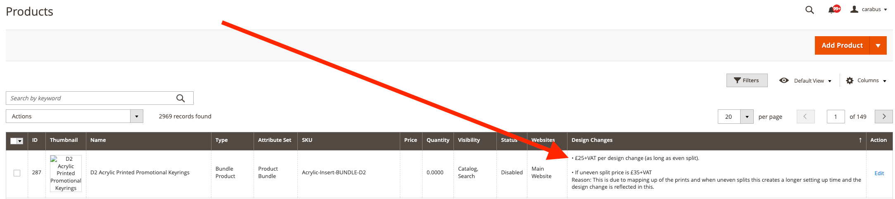

# LiquidLab MultilineGrid Module

This module provides a solution for displaying multiline text in Magento 2 admin grids. It preserves line breaks in text area custom attributes when displayed in the admin product grid.

## Before and After

### Before


### After


## Installation

1. The module is already installed in your Magento 2 instance.
2. After making any changes to the module, you need to deploy the static content and clear the cache:
   ```
   bin/magento setup:upgrade
   bin/magento setup:di:compile
   bin/magento setup:static-content:deploy -f
   bin/magento cache:clean
   bin/magento cache:flush
   ```

## Usage

The module automatically applies to all columns in the admin grid. No additional configuration is needed in your UI component XML.

## How It Works

The module uses a mixin approach to:

1. Extend the default Magento UI column functionality
2. Convert newlines (`\n`) to HTML `<br>` tags
3. Use Knockout's `html` binding instead of `text` binding to preserve HTML formatting

This ensures that line breaks in text area fields are properly displayed in the admin grid without requiring any changes to your UI component XML files.

## Technical Details

The module follows Magento's best practices for mixins:

1. The `requirejs-config.js` file is placed in the `view/adminhtml` directory
2. It defines a mixin for the `Magento_Ui/js/grid/columns/column` component
3. It includes a path mapping for templates: `'liquidlab/template': 'Liquidlab_MultilineGrid/templates'`
4. The mixin overrides the `getLabel` method to convert newlines to `<br>` tags
5. The mixin sets the `bodyTmpl` to use a custom template with the `html` binding using the mapped path: `bodyTmpl: 'liquidlab/template/grid/cells/multiline'`

This approach automatically applies to all columns in the admin grid, making it a more elegant solution than creating a custom column type.

After making changes to the module, always run the deployment commands listed in the Installation section to ensure the changes take effect. This is especially important when modifying RequireJS configurations and template paths.
